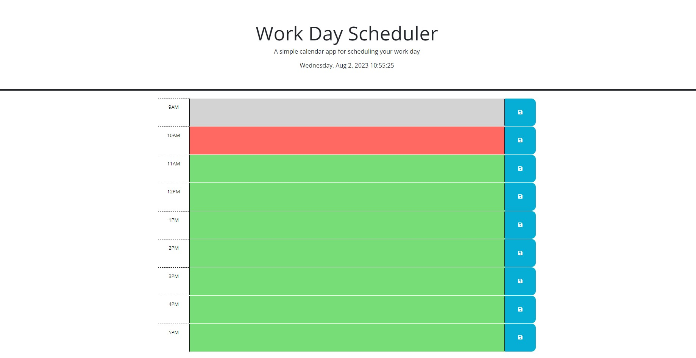
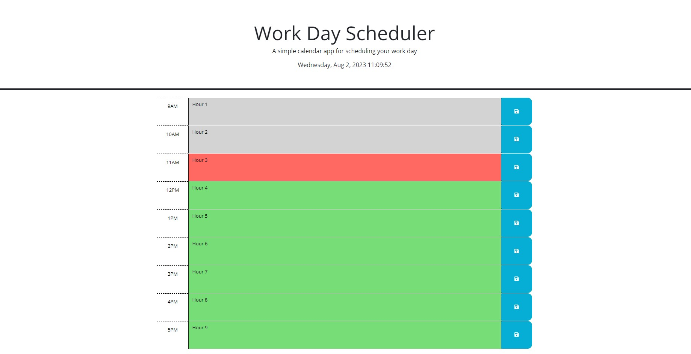

# Business Work Day Scheduler

## Description

As a business employee, my schedule is tight. I have to meet deadlines, attend meetings, and find time for myself during the work day to independently get my work done. To help address these concerns, I have developed a work day scheduler from an existing daily planner template so that I can plan out my work days from 9:00am to 5:00pm. This allows me to visually see my schedule laid out in front of me, as opposed to keeping tabs of my schedule in my mind. From working on this planner, I've come to the realization that using third-party API's to help make the structure of my website makes my life so much easier compared to building websites from scratch.

## Usage

Here is an example preview of the website: https://abrentis.github.io/Work-Day-Scheduler/

Each time block is color-coded in relation to the current hour. Past hours are colored gray; the current hour is colored red; and future hours are colored green.

To fill in a time block, click on the text area within a given time block and enter what you would like to schedule for that time. Once you are done, click on the time block's blue save button to save the text you entered. When you revisit or reload the page, your saved schedule entries will appear within their respective time blocks.

Here is an example of what a filled out schedule looks like:

## License

MIT license (refer to LICENSE file in GitHub repository for further information)